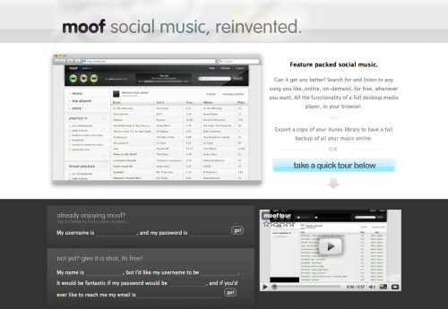
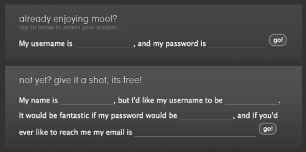
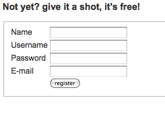
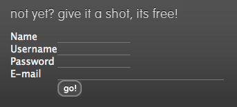
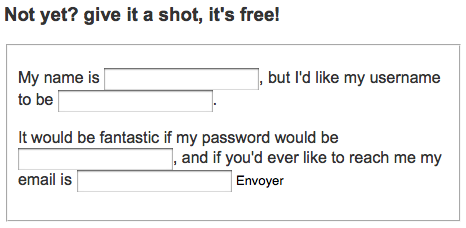

[Moof](http://moof.com/) est une n-ième application Web d’écoute de musique, mais je ne m’étendrais pas sur les fonctionnalités, là n’est pas le sujet. Une originalité de Moof, c’est qu’ils proposent directement sur la page d’accueil le formulaire de création de compte, alors que c’est en général déporté sur une page dédiée.

L’idée sympa — déjà croisée ailleurs ces dernières années, il faut l’avouer, même si je ne saurais plus dire où exactement — c’est de présenter ce formulaire comme un dialogue entre l’application et l’utilisateur. Sauf que cela respecte tellement peu les [usages courants](/2011/02/respecter-les-usages-courants.html) que je n’ai pas trouvé le formulaire tout de suite, cherchant un classique lien « *register* » ou « *sign up* ».

<figure markdown="1">
  
</figure>

Voici en gros plan l’objet du délit :

<figure markdown="1">
  
</figure>

On pourra s’extasier sur l’apparence sympathique de ces formulaires — [tel Karl Dubost](http://twitter.com/karlpro/statuses/2909027575) — mais il ne faudrait pas oublier que certains ne verront pas là le moindre appel à saisir quelque info que ce soit, tout ceci ne ressemblant pas du tout à un formulaire.

Voici pour mémoire à quoi ressemble par défaut un formulaire présenté traditionnellement dans un format tabulaire :

<figure markdown="1">
  
</figure>

Avec un peu de styles, on peu le rendre un peu plus sexy :

<figure markdown="1">
  
</figure>

Sinon, si le style de mise en scène du formulaire est plus important que sa présentation purement graphique, conserver l’aspect sympa du texte à trou est bien sûr possible :

<figure markdown="1">
  
</figure>

En rajoutant un peu de styles à cela, on obtient presque le même effet que le formulaire de Moof, mais en laissant à l’utilisateur la possibilité de comprendre rapidement qu’il s’agit d’un formulaire :

<figure markdown="1">
  
</figure>

Comme souvent en ergonomie, la difficulté est de savoir où s’arrêter dans l’innovation, de se démarquer des autres sans pour autant perdre les utilisateurs en leur imposant un effort de réflexion qu’ils ne sont que rarement prêts à faire.

Alors certes, cela va sans doute faire un peu de *buzz* et attirer de potentiels utilisateurs parmi les férus de design Web, mais [respecter les usages courants](/2011/02/respecter-les-usages-courants.html) permettrait à priori à encore plus d’utilisateurs — ceux-là pas du tout intéressés par l’aspect graphique de la chose, mais bien par la musique — de vite comprendre comment s’inscrire pour profiter du service.
