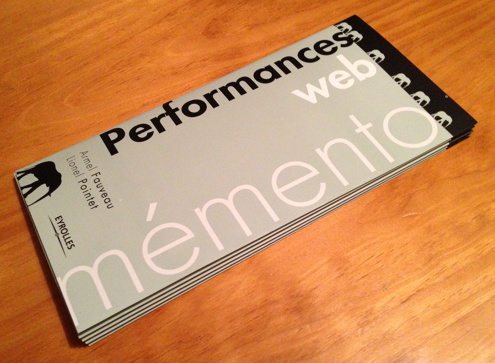
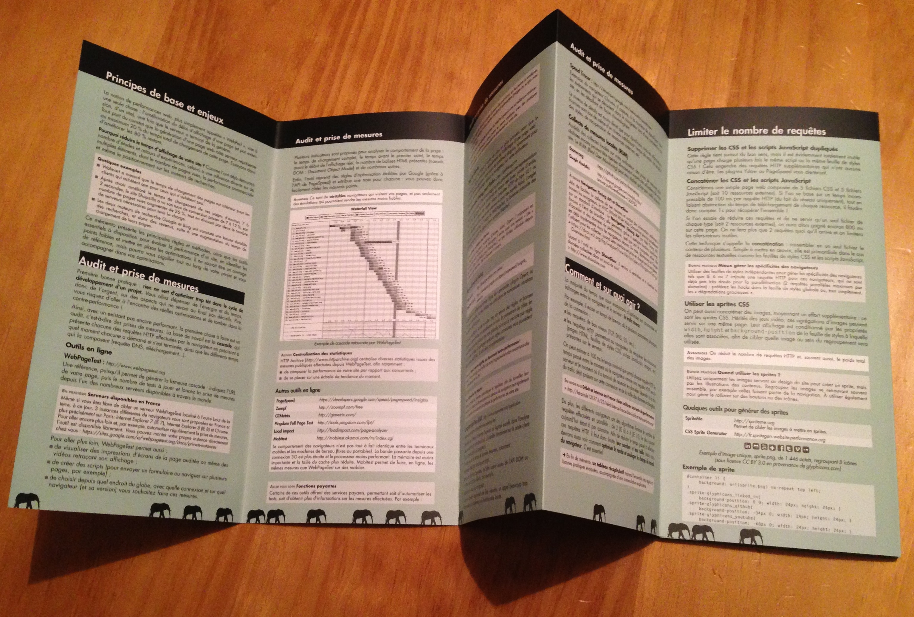

La [collection «mémento» de chez Eyrolles](http://www.eyrolles.com/Informatique/Collection/4143/memento.php) vient de s'agrandir, avec l'ajout d'un petit nouveau dédié aux [performances web](http://www.eyrolles.com/Informatique/Livre/memento-performances-web-9782212136586), en termes de vitesse. Incontournable !
<figure>
  
</figure>

Et je ne dis pas ça juste parce que j'ai eu l'honneur d'être invité à participer à sa relecture par ses auteurs [Armel Fauveau](https://twitter.com/fauveauarmel) et [Lionel Pointet](https://twitter.com/lpointet)[^1], c'est vraiment un condensé — très complet et didactique tout de même — des principales bonnes pratiques à respecter pour développer des sites performants, et donc plus agréables pour les visiteurs.

L'optimisation de la vitesse des sites web est en effet un des éléments clefs aujourd'hui de la satisfaction des Internautes, et de leur envie de continuer leur navigation sur le site, voire même d'acheter des produits et/ou services.

<figure>
  
</figure>

En plus, ce mémento a le bon goût de citer mon billet où j'explique pourquoi « [PageSpeed et YSlow ne sont pas des indices de performance](http://www.clever-age.com/veille/reactions/pagespeed-et-yslow-ne-sont-pas-des-indices-de-performance.html) »… ;-)

Bravo à [Karine Joly](http://twitter.com/kjoly) de Eyrolles pour cette nouvelle référence et merci à Armel et Lionel pour le travail réalisé !

[^1]: Aux côtés de Delphine Malassingne et Eric Daspet, c'est dire la qualité finale !
