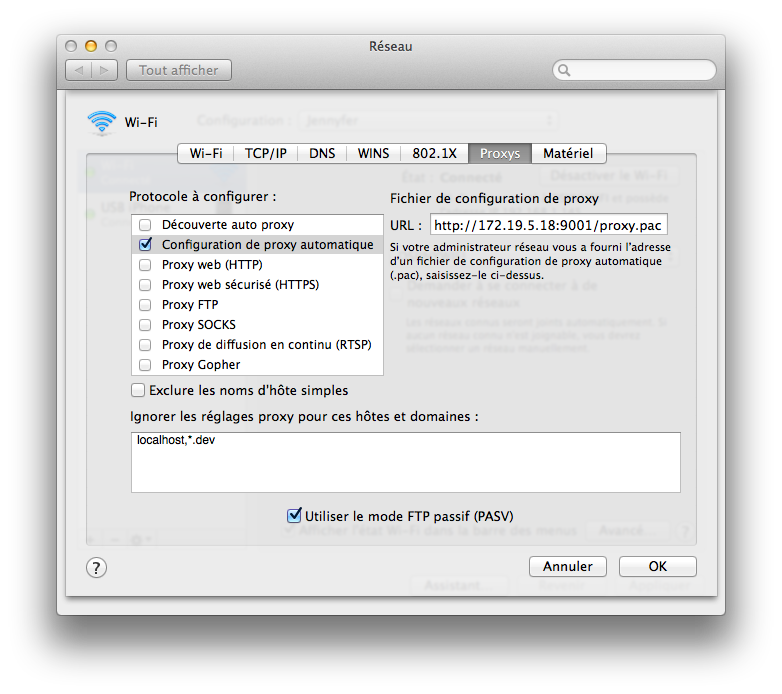
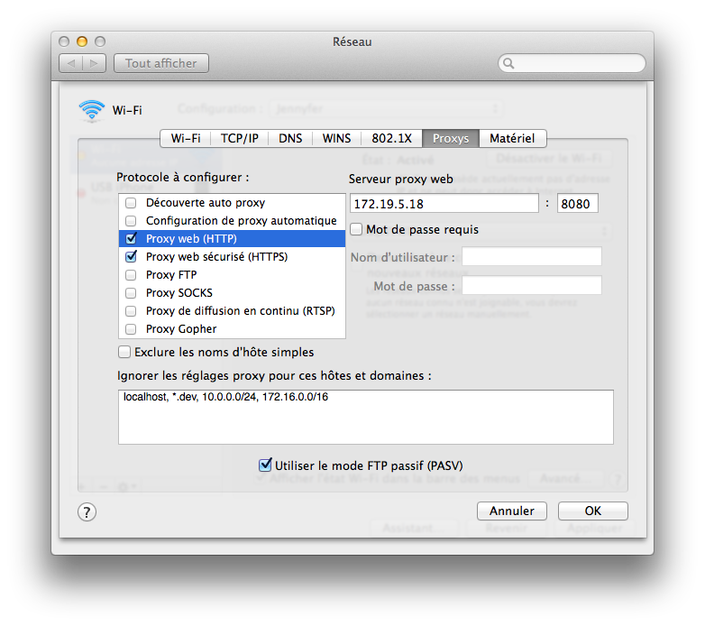

Quand les clients ne nous imposent pas de travailler sur leurs propres machines —heureusement pas trop souvent—, ils nous imposent souvent un proxy pour accéder à Internet, le grand méchant loup. S'il est bien connu que les règles de filtrage imposées sont souvent contre productives, l'auto configuration à l'aide d'un fichier `.pac` peut ajouter une contrainte supplémentaire pour les développeurs.

En effet, le simple fait d'utiliser un fichier `.pac` pour configurer automatiquement le proxy fait ignorer complètement la liste d'adresses et domaines pour lesquels il faudrait ignorer cette configuration, comme l'indique l'article « [Mac OS X: Bypassing proxy settings for specific IP addresses](http://support.apple.com/kb/ht4654) » de la base de connaissance Apple :

> When you use a .pac file, the hosts to bypass are specified in that file, and hosts listed in the Network preference pane are ignored.

Par exemple, si j'ai le fichier `proxy.pac` suivant :

```
function FindProxyForURL(url, host)
{
if (
	isInNet(host, "10.0.0.0", "255.0.0.0") ||
	isInNet(host, "172.16.0.0", "255.240.0.0")
		)
	return "DIRECT";
else
	return "PROXY 172.19.5.18:8080";
}
```

Et le paramétrage de proxy suivant dans Mac OS X :

<figure>
  
</figure>

Alors le réglage « Ignorer les réglages proxy pour ces hôtes et domaines » sera bonnement et simplement ignoré[^1].

Pour conserver le proxy uniquement pour les IP souhaitées, tout en concervant la possibilité de définir des exceptions, il est nécessaire d'éclater le `proxy.pac` en règles statiques[^2].

Voilà ce que cela donne :

<figure>
  
</figure>

Mes connaissances réseau sont bien rouillées, donc je vous laisse expliquer en commentaires la signification exacte des `/16` et `/24`.

Et hop, tout fonctionne parfaitement…

[^1]: La fenêtre de préférence pourrait avoir la bonne idée de l'indiquer, d'ailleurs

[^2]: Attention, on perd au passage l'avantage du `proxy.pac` qui peut être modifié en central et pris en compte automatiquement sur toutes les machines.
